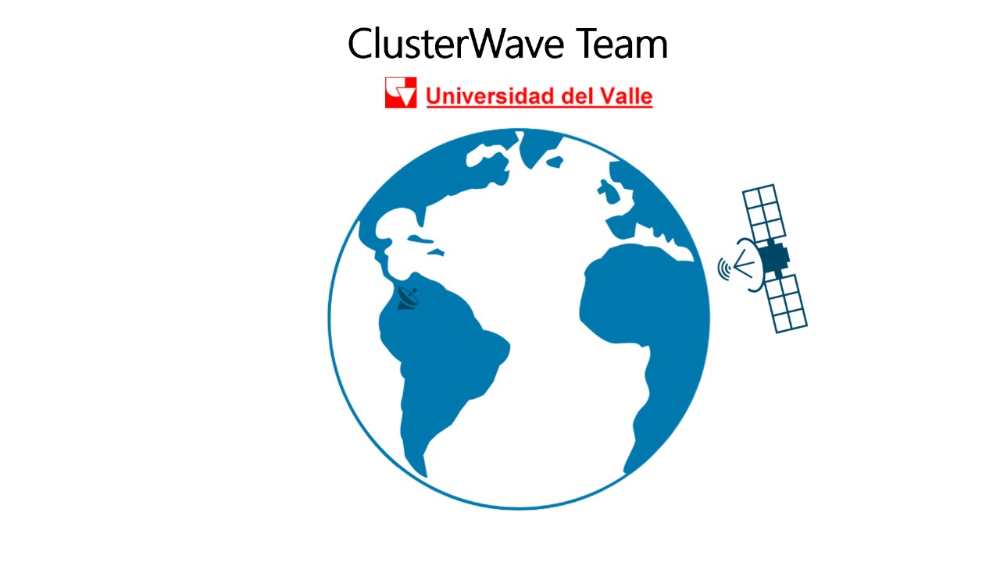

# ImageLockdown
ImageLockdown is a powerful tool designed for encrypting and decrypting satellite images.

## Compilation Steps

To compile the ImageLockdown program, follow these steps:

1. **Clone the repository:**

    ```bash
    git clone https://github.com/Hackabros-INC/ImageLockdown.git
    ```

2. **Execute cmake:**

    ```bash
    cmake .
    ```

3. **Compile the program using `make`:**

    ```bash
    make
    ```

    This command will create an executable named `main` in the root directory.

4. **Run the executable:**

    ```bash
    ./main
    ```

### Notes:
- The program has been tested on Linux operating systems.
- To clean up the `build` directory and remove the `ImageLockdown` executable, use the following command:

    ```bash
    make clean
    ```

- The OpenSSL library is required for the program to function correctly. Make sure it is installed on your system.

## Assets
In the `assets` directory, you will find:
- Two files containing the program's performance metrics with various datasets.
- A PDF document that provides a detailed explanation of the program's design and the implemented solution.
- A video explaining the implementation of the solution.

## Video Explanation
Below is the video that explains the implementation of the solution:

[](assets/implementation_video.mp4)

## Authors
This program was developed by:

1. [Harold Andres Riascos Manyoma](https://github.com/Larryc8)
2. [Jose Miguel Caicedo Ortiz](https://github.com/JOSEMIGUELCAICEDOORTIZ)
3. [Julian Esteban Gallego Lenis](https://github.com/Lazk3r)
4. [Santiago Ruiz Quintero](https://github.com/Santiago7768)
